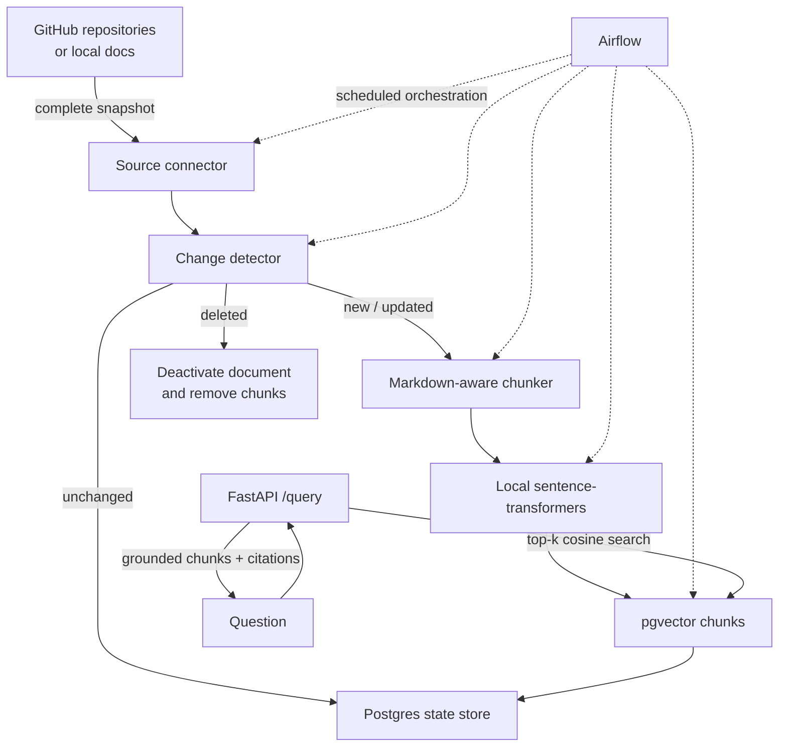
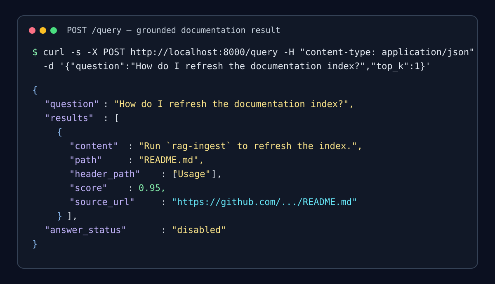
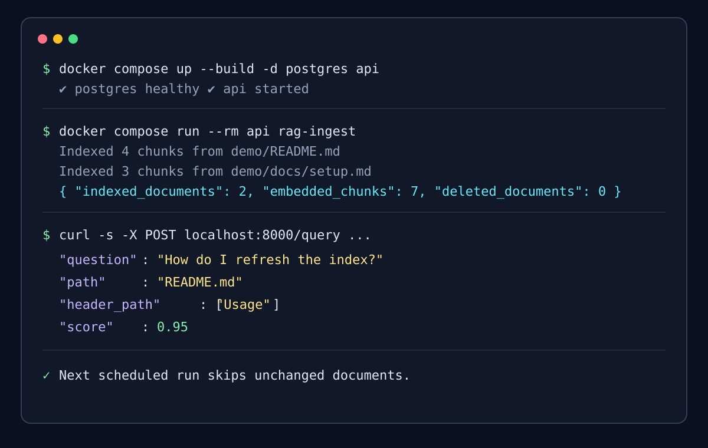

# RAG Ingestion Pipeline

An incremental data pipeline that turns GitHub or local Markdown documentation into a searchable pgvector index. It is deliberately a data-engineering project first: the important work is reliable source snapshots, Markdown-aware chunking, change detection, transactional re-indexing, and scheduled refreshes—not calling an LLM.

## Why this exists

Retrieval quality starts with data quality. This project demonstrates the infrastructure behind grounded documentation Q&amp;A:

- Crawls Markdown from public GitHub repositories or a local documentation directory.
- Preserves Markdown section context and never splits fenced code blocks.
- Uses SHA-256 content hashes to skip unchanged documents and deactivate removed ones.
- Replaces a changed document's vectors transactionally in Postgres/pgvector.
- Runs on a schedule through Airflow and records each run's document/chunk metrics.
- Exposes a small FastAPI retrieval endpoint with source metadata and similarity filtering.

The optional answer synthesizer is a separate local-Ollama adapter. The ingestion and retrieval paths have no dependency on it.

## Architecture



## Stack

| Concern | Choice |
| --- | --- |
| Source | GitHub REST API or local Markdown directory |
| Embeddings | `sentence-transformers/all-MiniLM-L6-v2` |
| State + vectors | PostgreSQL 16 with pgvector and HNSW cosine index |
| Orchestration | Apache Airflow |
| Serving | FastAPI |
| Optional answer generation | Local Ollama; disabled by default |

## Quick start

### 1. Configure a source

Copy the template and choose a public repository allow-list or leave it empty to crawl the configured GitHub owner's eligible repositories. A GitHub token is optional for public repositories but avoids the unauthenticated API limit.

```powershell
Copy-Item .env.example .env
```

Edit `.env`:

```dotenv
GITHUB_OWNER=Murray-Assal
GITHUB_REPOSITORIES=RAG-Ingestion-Pipeline
# GITHUB_TOKEN=github_pat_...
```

To ingest a local directory instead, set `LOCAL_DOCS_PATH` to its absolute path in the ingestion process environment and leave `GITHUB_REPOSITORIES` blank. When running the job in Docker, bind-mount that directory into the `api` service and use its container path.

### 2. Start pgvector and the API

```powershell
docker compose up --build -d postgres api
```

The first embedding run downloads the selected sentence-transformers model. It is local and does not require a paid API key.

### 3. Create or refresh the index

```powershell
docker compose run --rm api rag-ingest
```

The command prints an auditable run summary. A second run against unchanged docs reports zero indexed documents and zero newly embedded chunks.

### 4. Retrieve documentation chunks

```powershell
$body = @{ question = "How do I refresh the documentation index?"; top_k = 3 } |
  ConvertTo-Json

Invoke-RestMethod -Method Post `
  -Uri http://localhost:8000/query `
  -ContentType "application/json" `
  -Body $body | ConvertTo-Json -Depth 8
```

`POST /query` returns `503` with a clear code when the index is empty or Postgres is unreachable. Scores below `SIMILARITY_THRESHOLD` are filtered out rather than returned as noise.

## Example query response



The endpoint returns the chunk content, repository, file path, header breadcrumb, score, and a source URL so any client can cite the original documentation. Set `ANSWER_GENERATION_ENABLED=true` only if a local Ollama model is available; the `answer` field then contains an optional grounded synthesis.

## Scheduled refresh with Airflow

Airflow uses the schedule and retry policy in `config/settings.yaml`. It executes independent stages for fetch, change detection, chunking, embedding, vector upsert, state update, and run metadata recording.

```powershell
docker compose --profile airflow up airflow-init
docker compose --profile airflow up -d airflow-webserver airflow-scheduler
```

Open [http://localhost:8080](http://localhost:8080) and trigger `ingest_docs_incremental`, or let the configured cron schedule run it. The development credentials are `admin` / `admin`.

## Configuration

| Setting | Purpose |
| --- | --- |
| `GITHUB_OWNER`, `GITHUB_REPOSITORIES`, `GITHUB_TOKEN` | GitHub source selection and optional authentication |
| `LOCAL_DOCS_PATH` | Local Markdown fallback source |
| `CHUNK_MAX_TOKENS`, `CHUNK_OVERLAP_TOKENS` | Chunk boundaries and overlap |
| `EMBEDDING_MODEL`, `EMBEDDING_DIMENSION` | Local embedding model and pgvector dimension |
| `TOP_K`, `SIMILARITY_THRESHOLD` | Retrieval result count and relevance floor |
| `ANSWER_GENERATION_ENABLED` | Enables optional local-Ollama synthesis; defaults to `false` |

The checked-in [settings file](config/settings.yaml) contains the orchestration schedule, retry policy, similarity default, and safe answer-generation defaults. Keep credentials in `.env`, not in version control.

## Test and quality checks

```powershell
python -m pip install -e ".[dev]"
python -m pytest -q
python -m ruff check . --select F,I
```

The CI workflow runs these checks on every push and pull request.

## Portfolio demo

The short terminal walkthrough shows the intended flow: start the stack, run a refresh, then query the API. Document and chunk counts are source-dependent.



The replayable capture and command transcript are in [docs/demo.cast](docs/demo.cast) and [docs/demo.md](docs/demo.md).
