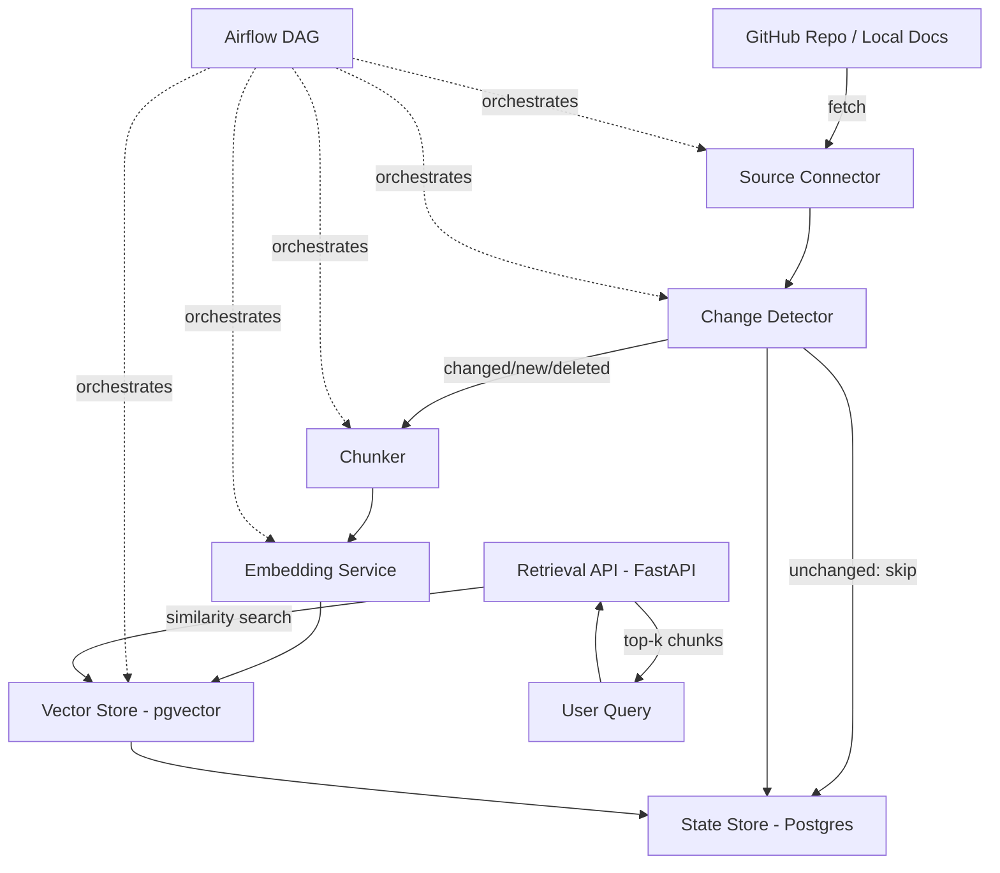

# RAG Ingestion Pipeline — Design

## 1. Architecture Overview



Everything runs in Docker Compose: one Postgres instance (with the `pgvector` extension) serves as both the state store and the vector store — no separate vector DB needed, which keeps the stack simple and free.

## 2. Components

### 2.1 Source Connector
- **Responsibility:** fetch markdown files from a configured GitHub repo (via GitHub API + PAT) or a local folder.
- **Output:** list of `(file_path, content, sha)` tuples.
- **Maps to:** Requirement 1.

### 2.2 Change Detector
- **Responsibility:** compare each fetched file's content hash against the `documents` table. Classify each as `new`, `updated`, `unchanged`, or `deleted` (present in state store but missing from fetch results).
- **Output:** a change set: `{new: [...], updated: [...], unchanged: [...], deleted: [...]}`.
- **Maps to:** Requirements 1, 4.

### 2.3 Chunker
- **Responsibility:** split each new/updated document by markdown headers and paragraphs, keeping fenced code blocks intact, and further splitting any section over the max token size.
- **Output:** list of `Chunk` objects with header-path metadata.
- **Maps to:** Requirement 2.

### 2.4 Embedding Service
- **Responsibility:** batch-embed chunks using a local `sentence-transformers` model (e.g. `all-MiniLM-L6-v2` — small, CPU-friendly, no API cost).
- **Output:** chunk objects with an attached vector.
- **Maps to:** Requirement 3.

### 2.5 Vector Store (pgvector)
- **Responsibility:** upsert new chunk embeddings, delete stale chunks for updated/deleted docs, serve similarity search for the API.
- **Maps to:** Requirement 4, 6.

### 2.6 State Store (Postgres)
- **Responsibility:** track document hashes/status and ingestion run history — this is what makes incremental indexing and idempotency possible.
- **Maps to:** Requirements 4, 5, non-functional idempotency.

### 2.7 Airflow DAG
- **Responsibility:** orchestrate the above in sequence on a schedule, with retries and failure notification.
- **Maps to:** Requirement 5.

### 2.8 Retrieval API (FastAPI)
- **Responsibility:** embed an incoming query, run similarity search against pgvector, return top-k chunks above a similarity threshold with source metadata.
- **Maps to:** Requirement 6.

### 2.9 (Optional) Answer Generator
- **Responsibility:** given retrieved chunks + query, call an LLM to produce a cited answer. Fully decoupled — the API works without it.
- **Maps to:** Requirement 7.

## 3. Data Models

**`documents`** (state store)
| column | type | notes |
|---|---|---|
| id | uuid (PK) | |
| source_path | text | e.g. `docs/install.md` |
| content_hash | text | sha256 of raw content |
| status | text | `active` / `deleted` |
| last_ingested_at | timestamptz | |

**`chunks`** (vector store, pgvector table)
| column | type | notes |
|---|---|---|
| id | uuid (PK) | |
| document_id | uuid (FK → documents.id) | |
| content | text | |
| header_path | text | e.g. "Install > Prerequisites" |
| chunk_position | int | order within document |
| embedding | vector(384) | dim matches embedding model |

**`ingestion_runs`** (state store)
| column | type | notes |
|---|---|---|
| id | uuid (PK) | |
| started_at / finished_at | timestamptz | |
| status | text | `success` / `failed` |
| docs_added / docs_updated / docs_deleted | int | |
| chunks_written | int | |
| error_message | text, nullable | |

## 4. Pipeline Flow (per DAG run)

1. **fetch_docs** → Source Connector pulls current file list + content + sha.
2. **detect_changes** → diff against `documents` table → change set.
3. **chunk_changed_docs** → run Chunker only on `new` + `updated` docs.
4. **embed_chunks** → batch-embed all chunks from step 3.
5. **upsert_vector_store** → for each `updated`/`deleted` doc, delete its existing chunk rows first, then insert new ones (transactional per document to avoid partial states).
6. **update_state_store** → upsert `documents` rows with new hash/timestamp; mark deleted docs as `status = deleted`.
7. **record_run_metadata** → write to `ingestion_runs`.
8. **notify_on_failure** → Airflow `on_failure_callback` posts to a Slack webhook (or logs, if no webhook configured) if any task failed after retries.

Steps 3–6 process **only** the changed set — this is what satisfies the incremental-indexing and idempotency requirements. An unchanged-file run should complete steps 1–2, find an empty change set, and skip 3–6 entirely.

## 5. Repo Structure

```
rag-ingestion-pipeline/
├── docker-compose.yml
├── dags/
│   └── ingest_docs_dag.py
├── src/
│   ├── source_connector.py
│   ├── change_detector.py
│   ├── chunker.py
│   ├── embedding_service.py
│   ├── vector_store.py
│   └── state_store.py
├── api/
│   └── main.py          # FastAPI retrieval endpoint
├── config/
│   └── settings.yaml    # source repo, chunk size, schedule, thresholds
├── tests/
└── requirements.md / design.md / tasks.md
```

## 6. Error Handling & Idempotency

- Each document's delete-then-insert into `chunks` happens inside a single DB transaction, so a crash mid-write never leaves half-updated chunks for one document.
- Source fetch failures abort the run before any state-store writes happen — the last good state is never corrupted (Requirement 1.4).
- Re-running with no source changes is a no-op past step 2, by design (Non-functional Requirement 1).

## 7. Config

`config/settings.yaml` externalizes: source repo URL/path, GitHub PAT (via env var, not committed), max chunk token size, embedding model name, similarity threshold, DAG schedule interval, Slack webhook URL (optional).

## 8. Deployment (Docker Compose services)

- `postgres` — pgvector-enabled image, hosts both state store and vector table.
- `airflow-webserver` + `airflow-scheduler` — standard Airflow, DAG mounted from `dags/`.
- `api` — FastAPI app, depends on `postgres`.

No external paid services required for the core pipeline, per Non-functional Requirement 2.
